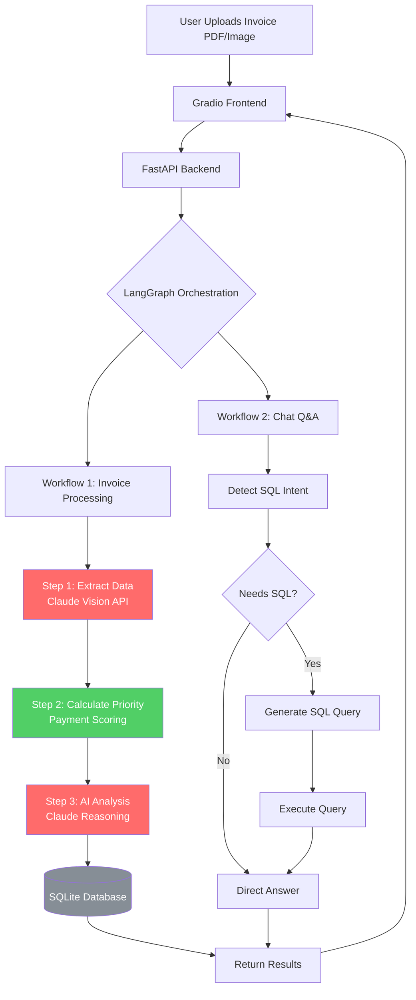
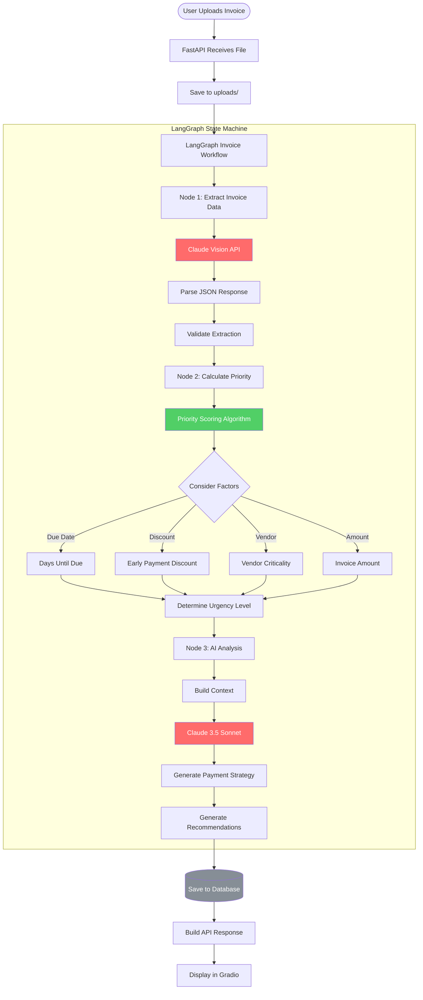
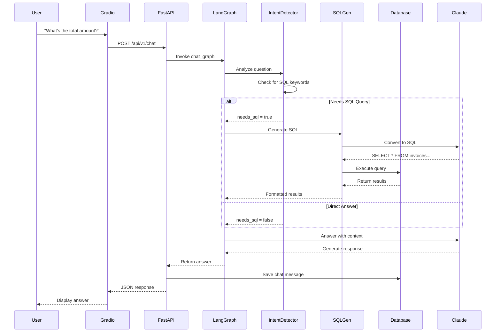
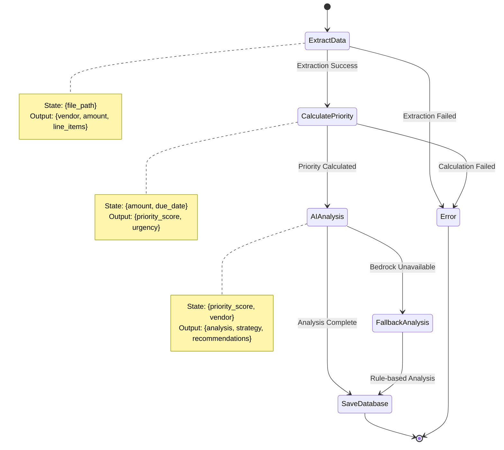
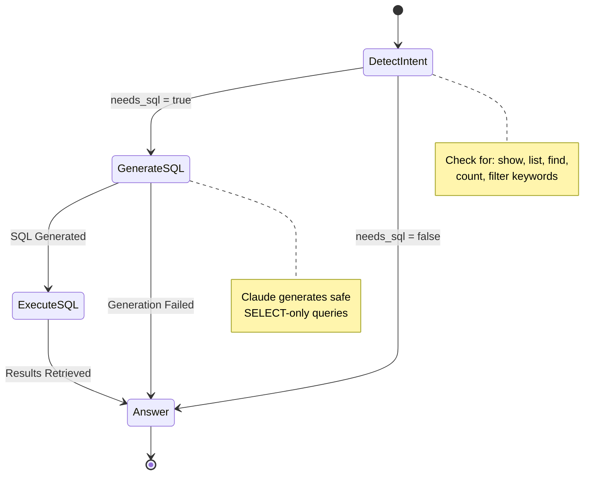
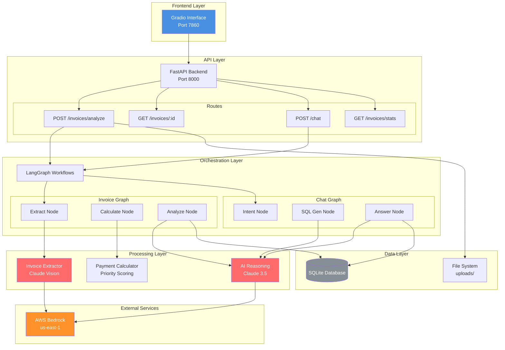
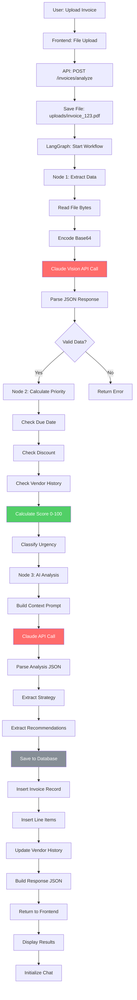
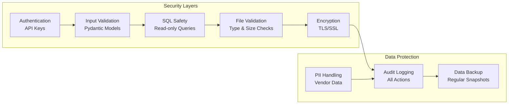

# Invoice Intelligence Agent - Architecture

## System Overview

AI-powered B2B invoice processing and payment optimization agent using AWS Bedrock, LangGraph, and FastAPI.

---

## High-Level System Flow

---

## Invoice Processing Workflow (Detailed)

---

## Chat Workflow (Conversational Q&A)

---

## LangGraph State Machines

### Invoice Processing State

### Chat Workflow State

---

## Database Schema

```mermaid
erDiagram
    INVOICES ||--o{ LINE_ITEMS : contains
    INVOICES ||--o{ CHAT_MESSAGES : has
    INVOICES }o--|| VENDOR_HISTORY : references
    
    INVOICES {
        int id PK
        string invoice_id UK
        string vendor_name
        string invoice_number
        float amount
        string currency
        datetime due_date
        datetime invoice_date
        float priority_score
        string urgency
        text analysis
        text payment_strategy
        string file_path
        datetime created_at
    }
    
    LINE_ITEMS {
        int id PK
        int invoice_id FK
        string description
        float quantity
        float unit_price
        float total_price
        string category
    }
    
    CHAT_MESSAGES {
        int id PK
        int invoice_id FK
        string session_id
        string role
        text content
        int tokens_used
        float cost
        datetime created_at
    }
    
    VENDOR_HISTORY {
        int id PK
        string vendor_name
        int total_invoices
        float total_amount_paid
        float average_payment_days
        float on_time_payment_rate
        string is_critical
        datetime last_invoice_date
    }
```

---

## Component Architecture

---

## Data Flow: Complete Analysis

---

## Technology Stack

| Layer | Technology | Purpose |
|-------|-----------|---------|
| **Frontend** | Gradio 4.19 | Interactive UI |
| **API** | FastAPI 0.109 | RESTful backend |
| **Orchestration** | LangGraph 0.0.45 | Multi-step workflows |
| **LLM** | AWS Bedrock | Claude 3.5 Sonnet |
| **Vision** | Claude Vision API | Invoice data extraction |
| **Database** | SQLite (dev) | Persistent storage |
| **File Processing** | python-magic | File type validation |
| **Cloud** | AWS | Bedrock service |

---

## Key Design Decisions

### 1. **LangGraph vs Simple Chains**
- **Choice:** LangGraph multi-step workflows
- **Reason:** Observable agent behavior, error recovery, conditional routing
- **Benefit:** Can see each step in workflow logs

### 2. **Claude Vision vs Traditional OCR**
- **Choice:** Claude Vision API
- **Reason:** Handles both PDFs and images, extracts structured data directly
- **Benefit:** No separate OCR + parsing steps needed

### 3. **Payment Priority Scoring**
- **Choice:** Rule-based algorithm + AI insights
- **Reason:** Deterministic scoring for consistency, AI for context
- **Benefit:** Explainable decisions for finance teams

### 4. **SQLite vs PostgreSQL**
- **Choice:** SQLite for demo, designed for PostgreSQL
- **Reason:** Zero setup, production migration ready
- **Trade-off:** Limited concurrency acceptable for demo

---

## Scalability Considerations

### Current (Demo):
- Single instance
- SQLite database
- Local file storage
- ~10 requests/minute

### Production (Scaled):
- Auto-scaling ECS containers
- RDS PostgreSQL
- S3 for file storage
- ~1000 requests/minute

### Bottlenecks & Solutions:
| Bottleneck | Solution |
|------------|----------|
| Claude API rate limits | Request queuing, caching |
| File processing | Async with Celery workers |
| Database connections | Connection pooling, read replicas |
| Storage | S3 + CloudFront CDN |

---

## Security Architecture

---

## Cost Breakdown

| Component | Dev Cost | Production (1000 invoices/month) |
|-----------|----------|----------------------------------|
| AWS Bedrock (Claude) | $3-5/demo | ~$150/month |
| Compute (ECS) | $0 | ~$50/month |
| Database (RDS) | $0 | ~$30/month |
| Storage (S3) | $0 | ~$10/month |
| **Total** | **$3-5** | **~$240/month** |

### Cost Optimization:
- Cache common analyses
- Batch API requests
- Use reserved instances
- Implement request throttling

---

## Future Enhancements

1. **RAG Integration**
   - Vector database for historical patterns
   - Semantic search across invoices
   - "Find similar vendor invoices"

2. **Multi-Agent Architecture**
   - Extraction specialist agent
   - Payment strategy specialist agent
   - Coordinator routing agent

3. **Advanced Features**
   - Duplicate detection
   - Fraud detection
   - Budget tracking
   - Cash flow forecasting

4. **Integrations**
   - QuickBooks/Xero sync
   - Email invoice ingestion
   - Slack notifications
   - API webhooks

---

## Monitoring & Observability

### Metrics Tracked:
- Request latency (p50, p95, p99)
- Claude API token usage & cost
- Extraction success rate
- Database query performance
- Error rates by endpoint

### Logging:
- Structured JSON logs
- Agent decision traces
- LLM prompt/response logging
- Error stack traces with context

### Alerting:
- Error rate > 5%
- Latency p95 > 10s
- AWS costs > $100/day
- Database connection failures

---

## References

- [LangGraph Documentation](https://langchain-ai.github.io/langgraph/)
- [AWS Bedrock](https://aws.amazon.com/bedrock/)
- [Claude Vision API](https://docs.anthropic.com/claude/docs/vision)
- [FastAPI Documentation](https://fastapi.tiangolo.com/)