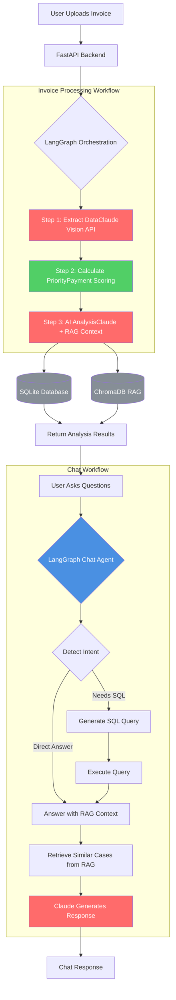

# 💰 Invoice Intelligence Agent

AI-powered B2B invoice processing and payment optimization using AWS Bedrock, LangGraph, and RAG.

[](https://www.python.org/)
[](https://fastapi.tiangolo.com/)
[](https://langchain.com/)
[](https://langchain-ai.github.io/langgraph/)
[](https://aws.amazon.com/bedrock/)

---

## 🎯 Overview

Production-grade agentic AI system for B2B finance automation:
- **Extract** invoice data using Claude Vision API
- **Prioritize** payments with intelligent scoring
- **Optimize** cash flow with AI-powered recommendations
- **Learn** from historical patterns using RAG

Built to demonstrate enterprise AI agent architecture for finance applications.

---

## 🏗️ System Architecture


See [ARCHITECTURE.md](ARCHITECTURE.md) for detailed diagrams.

---

## 🚀 Features

- ✅ **Multi-step Agent Workflows** - LangGraph orchestration with observable reasoning
- ✅ **AI-Powered Extraction** - Claude Vision API for PDF/image processing
- ✅ **Payment Optimization** - Priority scoring and strategic recommendations
- ✅ **RAG System** - ChromaDB vector store for historical pattern retrieval
- ✅ **Text-to-SQL** - Natural language database queries
- ✅ **RESTful API** - FastAPI with automatic Swagger documentation
- ✅ **Conversational Interface** - Context-aware Q&A with chat history
- ✅ **Observability** - Structured logging and workflow traces

---

## 🛠️ Technology Stack

| Layer | Technology | Purpose |
|-------|-----------|---------|
| **LLM** | AWS Bedrock (Claude 3.5 Sonnet) | AI reasoning and vision |
| **Orchestration** | LangGraph | Multi-step agent workflows |
| **Backend** | FastAPI | RESTful API |
| **RAG** | ChromaDB | Vector store for retrieval |
| **Database** | SQLite | Structured data storage |
| **Frontend** | Gradio | Interactive demo UI |
| **Cloud** | AWS | Bedrock inference |

---

## 📦 Installation

### Prerequisites:
- Python 3.10+
- AWS Account with Bedrock access (Claude 3.5 Sonnet enabled)
- 8GB RAM minimum

### Setup:
```bash
# Clone repository
git clone https://github.com/YOUR_USERNAME/invoice-intelligence-agent.git
cd invoice-intelligence-agent

# Create virtual environment
python -m venv venv
source venv/bin/activate  # Windows: venv\Scripts\activate

# Install dependencies
pip install -r requirements.txt

# Configure environment
cp .env.example .env
# Edit .env with your AWS credentials
```

---

## ⚙️ Configuration

Create `.env` file:
```bash
# AWS Configuration
AWS_REGION=us-east-1
AWS_ACCESS_KEY_ID=your_access_key_here
AWS_SECRET_ACCESS_KEY=your_secret_key_here

# Database
DATABASE_URL=sqlite:///./invoice_intelligence.db

# Application
UPLOAD_DIR=uploads/invoices
REPORTS_DIR=uploads/reports
MAX_FILE_SIZE=10485760

# API
API_TITLE=Invoice Intelligence Agent
API_VERSION=1.0.0

# Vector Store
VECTOR_DB_PATH=./chroma_db
```

---

## 🏃 Running the Application

### Start Backend:
```bash
uvicorn app.main:app --reload --host 0.0.0.0 --port 8000
```

### Start Frontend (separate terminal):
```bash
python frontend/gradio_app.py
```

### Access:
- **Gradio UI:** http://localhost:7860
- **API Docs:** http://localhost:8000/docs
- **Health Check:** http://localhost:8000/health

---

## 📖 Usage

### Via Gradio UI:
1. Open http://localhost:7860
2. Upload invoice (PDF, JPEG, PNG)
3. Click "Analyze Invoice"
4. View results: priority score, AI analysis, recommendations
5. Ask questions: "What's the payment strategy?"

### Via API:
```bash
# Analyze invoice
curl -X POST "http://localhost:8000/api/v1/invoices/analyze" \
  -F "file=@invoice.pdf"

# Chat about invoice
curl -X POST "http://localhost:8000/api/v1/chat" \
  -H "Content-Type: application/json" \
  -d '{
    "invoice_id": "abc-123",
    "question": "What is the recommended payment strategy?"
  }'

# Get statistics
curl "http://localhost:8000/api/v1/invoices/stats/summary"
```

---

## 🔍 RAG (Retrieval-Augmented Generation)

The system uses ChromaDB to store and retrieve historical invoice analyses:

**Semantic Search:**
```python
# Find similar past invoices
similar = rag.retrieve_similar_invoices(
    query="Acme Corporation consulting invoice",
    n_results=3
)
```

**Vendor Patterns:**
```python
# Get vendor payment history
history = rag.get_vendor_history("Acme Corporation")
# Returns: 12 past invoices, avg $4.5K, always paid early
```

**Context-Aware Recommendations:**
```
"Based on 12 past invoices with this vendor averaging $4,500 
and consistent early payment, recommend maintaining relationship 
by paying within 10 days to capture 2% discount."
```

---

## 🧪 Testing
```bash
# Test AWS Bedrock connection
python test_bedrock.py

# Test RAG system
python test_rag.py

# Test database setup
python test_db_setup.py

# Create sample invoice
python create_sample_invoice.py
```

---

## 📁 Project Structure
```
invoice-intelligence-agent/
├── app/
│   ├── main.py                 # FastAPI application
│   ├── config.py               # Settings
│   ├── agents/
│   │   ├── graph.py            # LangGraph workflows
│   │   └── tools.py            # Agent tools
│   ├── models/
│   │   ├── invoice_extractor.py   # Claude Vision extraction
│   │   └── payment_calculator.py  # Priority scoring
│   ├── core/
│   │   ├── aws_bedrock.py      # AWS Bedrock client
│   │   └── vector_store.py     # RAG with ChromaDB
│   ├── api/routes/
│   │   ├── invoices.py         # Invoice endpoints
│   │   └── chat.py             # Chat endpoints
│   └── database/
│       ├── models.py           # SQLAlchemy models
│       └── crud.py             # Database operations
├── frontend/
│   └── gradio_app.py           # Gradio UI
├── tests/
├── ARCHITECTURE.md             # Detailed architecture
├── requirements.txt
├── .env.example
└── README.md
```

---

## 🎯 Key Design Decisions

### **LangGraph vs Simple Chains**
- **Choice:** LangGraph multi-step workflows
- **Reason:** Observable agent behavior, error recovery, conditional routing
- **Benefit:** See each step in workflow logs, production debugging

### **Claude Vision vs Traditional OCR**
- **Choice:** Claude Vision API
- **Reason:** Handles PDFs and images, extracts structured data directly
- **Benefit:** No separate OCR + parsing pipeline needed

### **ChromaDB vs Managed Vector DB**
- **Choice:** ChromaDB for demo, designed for migration
- **Reason:** Zero setup, local-first, easy demonstration
- **Production:** Pinecone or Pgvector for scale

### **Payment Priority Algorithm**
- **Choice:** Rule-based scoring + AI insights
- **Reason:** Deterministic for consistency, AI for context
- **Benefit:** Explainable decisions for finance teams

---
<!-- 
## 💰 Cost Estimate

**Development/Demo:**
- AWS Bedrock: $3-5 per demo session
- Other services: Free (local)

**Production (1000 invoices/month):**
- AWS Bedrock: ~$150/month
- Compute (ECS): ~$50/month
- Database (RDS): ~$30/month
- Storage (S3): ~$10/month
- **Total: ~$240/month** -->

---

## 🔒 Security

- ✅ Environment-based configuration (no hardcoded secrets)
- ✅ Read-only SQL queries for safety
- ✅ Input validation with Pydantic
- ✅ File type and size verification
- ✅ AWS IAM for access control

**Never commit:**
- `.env` files
- AWS credentials
- API keys
- Invoice files

---

<!-- ## 🚀 Production Deployment

**For production:**
1. Migrate to PostgreSQL (SQLite not for production)
2. Deploy FastAPI to AWS ECS or Lambda
3. Use S3 for invoice storage
4. Switch to Pinecone or Pgvector for RAG
5. Add CloudWatch monitoring
6. Set up CI/CD pipeline
7. Enable auto-scaling -->

---

## 📊 Performance

- Invoice processing: ~5-8 seconds
- RAG retrieval: <500ms
- API response time: p95 < 10s
- Concurrent users: 10+ (demo), 1000+ (production with scaling)

---

<!-- ## 🛣️ Roadmap

- [ ] Duplicate invoice detection
- [ ] Batch processing endpoint
- [ ] Email notifications for urgent invoices
- [ ] Budget tracking and forecasting
- [ ] Multi-currency support
- [ ] QuickBooks/Xero integration
- [ ] Mobile app (iOS/Android) -->

---

## 🤝 Contributing

This is a portfolio/demonstration project. For suggestions or issues, please open a GitHub issue.

---

## 📄 License

This project is for educational and portfolio purposes.

---

## 👤 Author

**Eldor Ibragimov**
- GitHub: [@ibragimoveldor](https://github.com/ibragimoveldor)
- LinkedIn: [https://www.linkedin.com/in/eldor-ibragimov/]
- Portfolio: [https://eldoribragimov.cv/]

---

## 🙏 Acknowledgments

- Anthropic for Claude AI
- AWS for Bedrock platform
- LangChain team for agent frameworks
- ChromaDB for vector database

---

## 📚 Resources

- [LangGraph Documentation](https://langchain-ai.github.io/langgraph/)
- [AWS Bedrock](https://aws.amazon.com/bedrock/)
- [Claude API Docs](https://docs.anthropic.com/)
- [FastAPI Documentation](https://fastapi.tiangolo.com/)

---

**Built to demonstrate production-grade agentic AI for B2B finance automation** 🚀